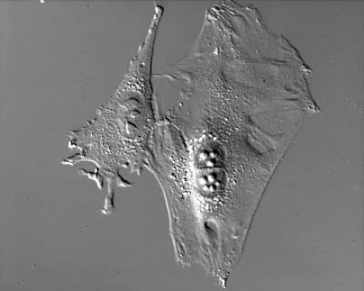

# CTMC-v1-solution
This repostitory contains the 2021 [CTMC-v1](https://motchallenge.net/data/CTMC-v1/) (Cell Tracking With Mitosis Detection Dataset Challenge) solution - CTMC-v1 is part of the [MOT Challenge](https://motchallenge.net/).

More details and step by step expalantion can be found in [this](https://deepdrive.pl/trening-yolov4-i-sledzenie-obiektow-ctmc-v1/) (Polish only) blog post.

We follow a tracking-by-detection approach
- detection is done using a [trained YOLOv4 model](https://www.dropbox.com/s/kivz7s1dfyp4ndg/011-v4_best.weights?dl=1)
- we provide examples with three different tracking methods:
  - [IoU Tracking](https://github.com/bochinski/iou-tracker)
  - [V-IoU Tracking](https://github.com/bochinski/iou-tracker)
  - [norfair](https://github.com/tryolabs/norfair).

## Sample sequence frame


## Instructions

### Clone the repository
```
git clone https://github.com/deepdrivepl/CTMC-v1-solution.git
cd CTMC-v1-solution
```

### Install the requirements

```
conda create -n CTMC python=3.7
conda activate CTMC
pip install -r requirements.txt
```

### Run inference ([weights](https://www.dropbox.com/s/kivz7s1dfyp4ndg/011-v4_best.weights?dl=1))

```
darknet detector test cfgs/011-v4.data cfgs/011-v4.cfg backups/011-v4_best.weights -ext_output -dont_show -out results/011-best-val.json < filelists/011-val
```

### Convert detections to MOT format

```
python MOT/yolo2MOT/yolo2MOT.py --input results/011-best-val.json --out_dir results/011-best-val/detection --json
```

### Run IoU Tracking

```
git clone https://github.com/bochinski/iou-tracker.git
cd iou-tracker
while read p; do python demo.py --detection_path ../results/011-best-val/detection/$p.txt --output_path ../results/011-best-val/iou/$p.txt --format motchallenge; done < ../filelists/011-val-seq
```

### Run V-IoU Tracking
To run V-IoU Tracking, you need to download training images and save them in the `train` directory.
```
while read p; do python demo.py --detection_path ../results/011-best-val/detection/$p.txt --output_path ../results/011-best-val/viou/$p.txt --format motchallenge --frames_path ../train/$p/img1/{:06d}.jpg --visual KCF; done < ../filelists/011-val-seq
```

### Run tracking with norfair
[Jupyter notebook](https://github.com/deepdrivepl/CTMC-v1-solution/blob/main/track_norfair.ipynb)

### Visualize
```
python MOT/visualizeMOT.py --imgs train --mot_dir results/011-best-val/iou --out_dir results/011-best-val/iou --img_mot
python MOT/visualizeMOT.py --imgs train --mot_dir results/011-best-val/viou --out_dir results/011-best-val/viou --img_mot
python MOT/visualizeMOT.py --imgs train --mot_dir results/011-best-val/norfair --out_dir results/011-best-val/norfair --img_mot
```

### Compute metrics

We use [py-motmetrics](https://github.com/cheind/py-motmetrics).
```
git clone https://github.com/cheind/py-motmetrics.git && cd py-motmetrics
python -m motmetrics.apps.eval_motchallenge ../train ../results/011-best-val/iou
python -m motmetrics.apps.eval_motchallenge ../train ../results/011-best-val/viou
python -m motmetrics.apps.eval_motchallenge ../train ../results/011-best-val/norfair
```

## Results

||IDF1|IDP|IDR|Rcll|Prcn|GT|MT|PT|ML|FP|FN|IDs|FM|MOTA|MOTP|IDt|IDa|IDm|
|--- |--- |--- |--- |--- |--- |--- |--- |--- |--- |--- |--- |--- |--- |--- |--- |--- |--- |--- |
|OVERALL IoU|46.5%|49.6%|43.7%|64.2%|72.9%|374|137|178|59|54413|81299|1864|4629|39.5%|0.295|115|1747|55|
|OVERALL v-IoU|45.4%|48.4%|42.7%|64.2%|72.8%|374|137|178|59|54528|81297|1968|4975|39.4%|0.296|107|1867|52|
|OVERALL norfair|52.0%|54.1%|50.0%|65.3%|70.6%|374|134|184|56|61925|78829|1107|3280|37.6%|0.298|118|894|64|


### Output video (YOLOv4 + norfair)
https://user-images.githubusercontent.com/39097446/131012746-d651e596-dd0a-4b86-9f21-42819e1b4a05.mp4


## Acknowledgements

- [https://github.com/bochinski/iou-tracker](https://github.com/bochinski/iou-tracker)
- [https://github.com/tryolabs/norfair](https://github.com/tryolabs/norfair)
- [https://github.com/cheind/py-motmetrics](https://github.com/cheind/py-motmetrics)
- [https://github.com/AlexeyAB/darknet](https://github.com/AlexeyAB/darknet)
